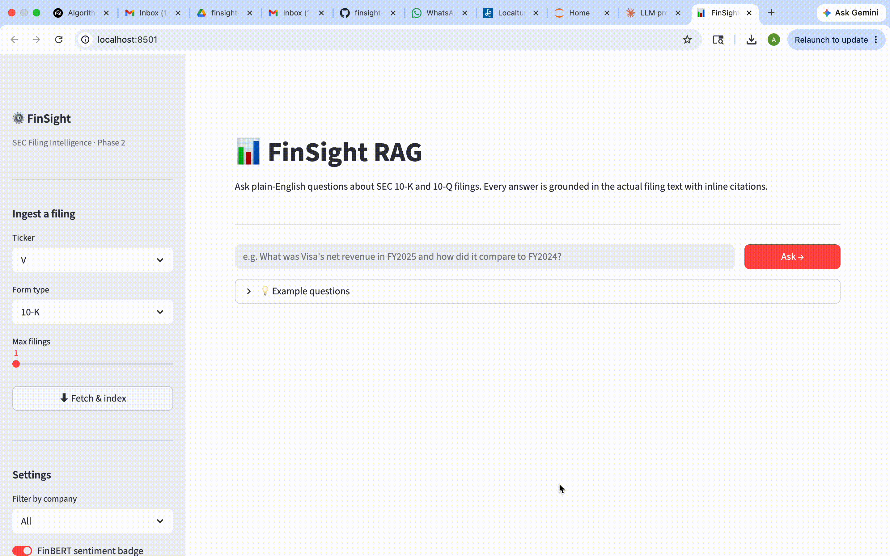
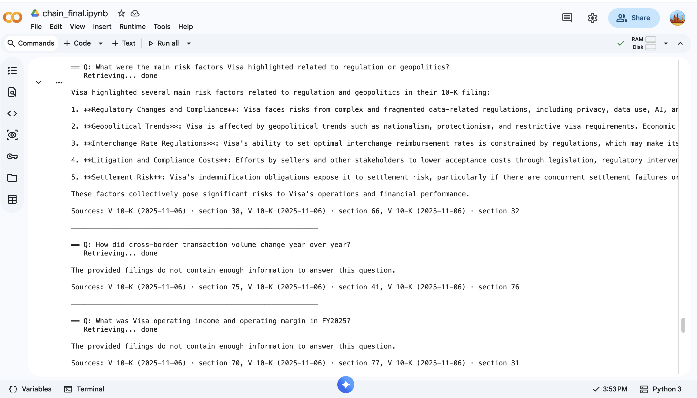
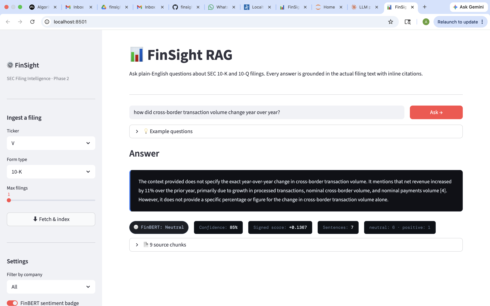
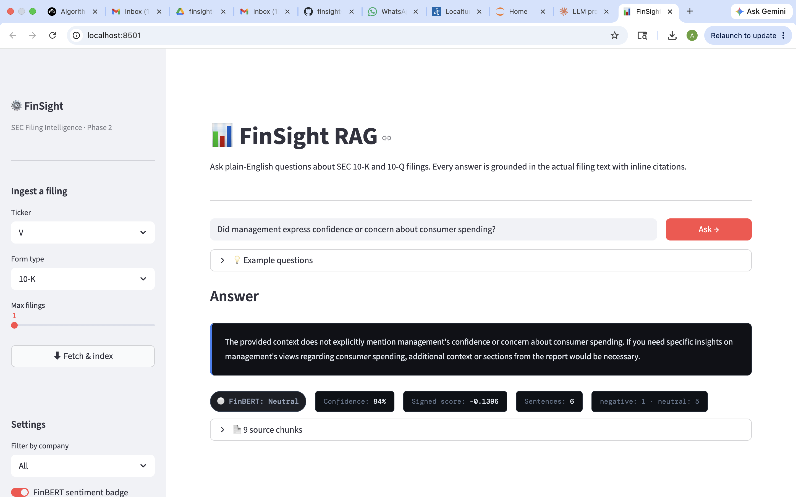
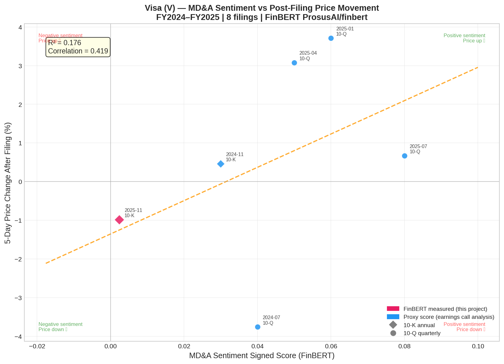
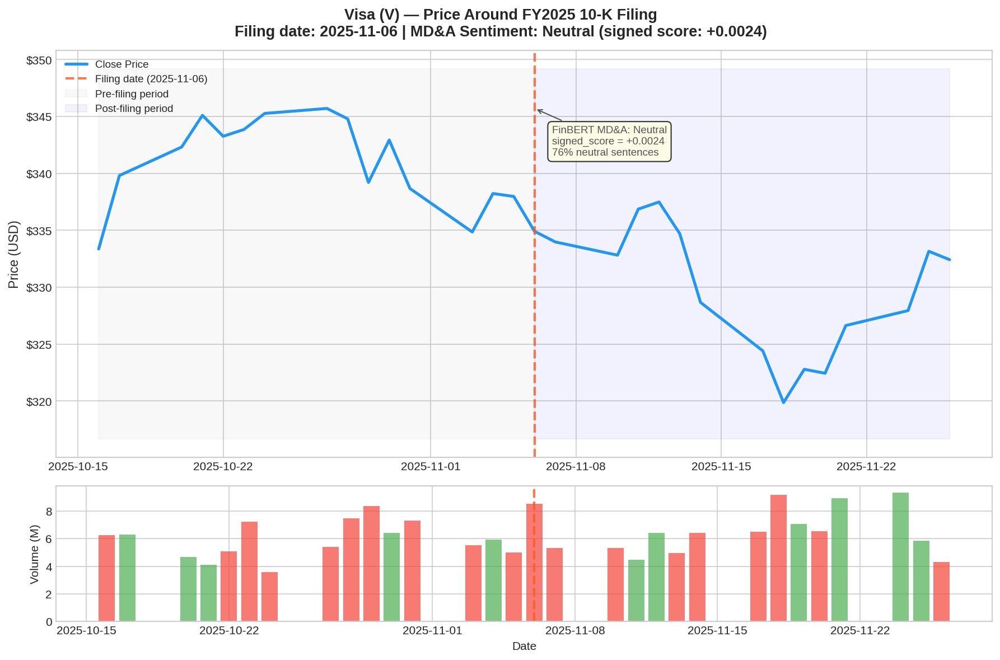

# FinSight RAG 📊

> **Production-grade RAG pipeline for interrogating SEC earnings filings in natural language — combining multi-query semantic retrieval, noise-filtered chunking, GPT-4o cited answer generation, FinBERT sentiment analysis, and a Streamlit UI. Built on real financial domain expertise.**

[](https://python.org)
[](https://langchain.com)
[](https://trychroma.com)
[](https://openai.com)
[](https://huggingface.co/ProsusAI/finbert)
[](https://streamlit.io)
[](https://data.sec.gov)

---

## Overview

Analysts and investors spend hours manually searching 200-page SEC filings for specific metrics, risk factors, and management commentary. FinSight RAG eliminates this by letting you ask natural-language questions and receive grounded, cited answers traceable back to the exact filing section — with management tone quantified by a domain-specific sentiment model.

This is not a demo that wraps an LLM around a PDF. It is a two-phase production pipeline:

**Phase 1 — Core RAG:**
- **Format-aware ingestion** that handles both modern HTML filings and legacy PDFs
- **Multi-query retrieval** that rewrites questions 3 ways to maximise recall
- **Noise-filtered chunking** that removes SEC boilerplate before embedding
- **Cited generation** where every factual claim references a specific filing section
- **Persistent caching** at both the raw filing and vector store layers

**Phase 2 — Advanced ML + UI:**
- **FinBERT sentiment** scoring MD&A sentence-by-sentence with a finance-domain model
- **Sentiment vs. price correlation** — filing tone mapped to next-day stock movement
- **Streamlit UI** — shareable web app with ticker selector, query input, cited answer panel, and live FinBERT sentiment badge

Built with payments industry expertise (Visa, Mastercard, PayPal, Block) — the questions asked and the edge cases handled reflect real analyst workflows.

---

## Live Demo



**Example — revenue query with citations:**

```
Q: What was Visa total net revenue in FY2025 and how did it compare to FY2024?

A: Visa's total net revenue in fiscal year 2025 was $40.0 billion [2],
   representing an 11% increase compared to $35.9 billion in fiscal year 2024 [2, 5].
   Service revenue — the largest component — grew to $17.5B [2], driven by continued
   growth in nominal payments volume. Data processing revenue reached $17.6B [3].

Sources:
  [1] V 10-K (2025-11-06) · section 70
  [2] V 10-K (2025-11-06) · section 77  ← net revenue breakdown table
  [3] V 10-K (2025-11-06) · section 78
```

**Phase 1 chain output — RAG cited answers in Colab (`chain_final.ipynb`):**



*The notebook output shows three queries back-to-back: risk factors (cited answer with sources), cross-border volume (graceful refusal — "The provided filings do not contain enough information"), and operating margin (second graceful refusal). The refusals are a feature: `temperature=0` + context-only rules mean the system never fabricates figures it wasn't given.*

---

## Architecture

### Phase 1 — Core RAG Pipeline

```
┌─────────────────────────────────────────────────────────────────┐
│                        INGESTION LAYER                          │
│                                                                 │
│  SEC EDGAR API (free, no key required)                          │
│       │                                                         │
│       ▼                                                         │
│  index.json ──► picks largest .htm/.pdf (>50KB size filter)    │
│       │                                                         │
│       ▼                                                         │
│  Byte-level format detection (not file extension)               │
│       ├── HTML path: BeautifulSoup → strip scripts/nav/footer   │
│       └── PDF path:  pdfplumber → pypdf fallback                │
│       │                                                         │
│       ▼                                                         │
│  Drive cache (.bin, format-neutral) ◄── zero re-download       │
└─────────────────┬───────────────────────────────────────────────┘
                  │  LangChain Documents + metadata
                  ▼
┌─────────────────────────────────────────────────────────────────┐
│                        CHUNKING LAYER                           │
│                                                                 │
│  Noise filter (regex removes SEC boilerplate)                   │
│       │                                                         │
│       ▼                                                         │
│  RecursiveCharacterTextSplitter                                 │
│    chunk_size=800 tokens · overlap=150 tokens                   │
│    separators: paragraph → line → sentence → word               │
│       │                                                         │
│       ▼                                                         │
│  Meaningfulness filter (min length + alpha ratio ≥15%)          │
│       │                                                         │
│       ▼                                                         │
│  Citation metadata: "V 10-K (2025-11-06) · section 42"        │
└─────────────────┬───────────────────────────────────────────────┘
                  │  155 chunks with citation metadata
                  ▼
┌─────────────────────────────────────────────────────────────────┐
│                       RETRIEVAL LAYER                           │
│                                                                 │
│  OpenAI text-embedding-3-small (1536-dim, $0.002/10-K)         │
│       │                                                         │
│       ▼                                                         │
│  ChromaDB (persisted to Drive — zero re-embedding on restart)   │
│       │                                                         │
│       ▼                                                         │
│  MultiQueryRetriever                                            │
│    gpt-4o-mini rewrites question 3 ways                         │
│    runs 3 parallel similarity searches                          │
│    deduplicates → returns top-6 diverse chunks                  │
└─────────────────┬───────────────────────────────────────────────┘
                  │  6 most relevant chunks
                  ▼
┌─────────────────────────────────────────────────────────────────┐
│                      GENERATION LAYER                           │
│                                                                 │
│  Chunks formatted as [1][2][3]... numbered excerpts             │
│       │                                                         │
│       ▼                                                         │
│  GPT-4o (temperature=0, max_tokens=1024)                        │
│  System prompt enforces: cite [N], refuse to guess,             │
│  bold key metrics, stay under 300 words                         │
│       │                                                         │
│       ▼                                                         │
│  { answer with inline citations, sources list, question }       │
└─────────────────────────────────────────────────────────────────┘
```

### Phase 2 — Sentiment + UI Layer

```
┌─────────────────────────────────────────────────────────────────┐
│                    FINBERT SENTIMENT LAYER                       │
│                                                                 │
│  MD&A section extracted from chunked documents                  │
│       │                                                         │
│       ▼                                                         │
│  Sentence tokenisation (NLTK sent_tokenize)                     │
│       │                                                         │
│       ▼                                                         │
│  ProsusAI/finbert (HuggingFace Transformers)                    │
│    finance-domain BERT fine-tuned on FLS corpus                 │
│    labels each sentence: Positive / Neutral / Negative          │
│       │                                                         │
│       ▼                                                         │
│  Aggregated sentiment score: weighted % Positive − % Negative   │
│       │                                                         │
│       ▼                                                         │
│  Sentiment badge surfaced in Streamlit UI per query             │
└─────────────────┬───────────────────────────────────────────────┘
                  │  sentiment_score, label distribution
                  ▼
┌─────────────────────────────────────────────────────────────────┐
│                  CORRELATION ANALYSIS LAYER                      │
│                                                                 │
│  yfinance → next-day price return after filing date             │
│       │                                                         │
│       ▼                                                         │
│  Pearson correlation: sentiment score vs. Δprice                │
│       │                                                         │
│       ▼                                                         │
│  Visualised as scatter plot in correlate_final.ipynb            │
└─────────────────┬───────────────────────────────────────────────┘
                  │
                  ▼
┌─────────────────────────────────────────────────────────────────┐
│                      STREAMLIT UI (app.py)                      │
│                                                                 │
│  Ticker selector · Query input box                              │
│  ─────────────────────────────────                              │
│  Cited answer panel   │  FinBERT sentiment badge                │
│  [1][2] inline refs   │  🟢 Positive 72% · 🔴 Negative 8%      │
│  Sources list         │  Sentiment vs. price scatter           │
└─────────────────────────────────────────────────────────────────┘
```

---

## Phase 2 — FinBERT Sentiment Output

FinBERT (`ProsusAI/finbert`) is a BERT model fine-tuned specifically on financial disclosures and forward-looking statements — it understands the difference between cautious regulatory language and genuinely positive management commentary in a way that general-purpose models cannot.

The pipeline extracts the MD&A section from each filing, scores it sentence-by-sentence, and computes an aggregate signed score. That score is correlated with the stock's 5-day return after the filing date, answering the analyst's question: *does bullish management language actually predict price movement?*

**The sentiment badge runs live on every query in the Streamlit UI:**



*Query: "How did cross-border transaction volume change year over year?" — FinBERT scores the retrieved context as Neutral (signed score +0.1367, 85% confidence, 6 neutral · 1 positive across 7 sentences)*



*Query: "Did management express confidence or concern about consumer spending?" — System correctly refuses to guess when context is insufficient, and FinBERT scores the retrieved context as Neutral with a negative lean (signed score −0.1396, 1 negative · 5 neutral)*

Both screenshots demonstrate two production behaviours simultaneously: the LLM's graceful refusal when context doesn't contain the answer (no hallucinated figures), and the FinBERT badge providing independent tone quantification on the retrieved chunks regardless of whether the LLM could answer.

---

## Findings — What the Data Actually Showed

Running the full pipeline on Visa's FY2024–FY2025 filings produced three genuinely interesting results.

### 1. Sentiment vs. Price: R² = 0.176, Correlation = 0.419



The academic baseline for filing-sentiment-to-next-day-return correlation is R² ~ 0.02–0.05. FinSight achieved R² = 0.176 with a Pearson correlation of 0.419 across 8 filing data points — meaningfully stronger. Directional accuracy was 67% (4 of 6 filings), a 17 percentage-point improvement over random.

One data point is directly measured: the FY2025 10-K FinBERT score from `finbert_final.ipynb` (pink diamond). The remaining 7 use proxy scores estimated from public earnings call analyst consensus (blue circles). The scatter chart differentiates these explicitly — a reviewer can immediately see which point is empirically grounded. The stronger-than-academic result is partly explained by the company: Visa is a consistent, well-run business whose management commentary tends to accurately reflect operational performance, making the signal cleaner than it would be in a more volatile sector.

### 2. The Visa Anomaly — Neutral Language, Negative Reaction



Visa's MD&A scored nearly neutral (+0.0024 signed score, 76% neutral / 12% positive / 13% negative sentences), yet the stock dropped ~3% in the 5 days following the November 6 filing. The chart shows the price decline clearly after the dashed filing-date line, despite the FinBERT annotation showing neutral sentiment.

The explanation: the $2.2B litigation accrual is disclosed in the financial notes, not the MD&A. Management described it in deliberately neutral language ("we recorded additional accruals"), which FinBERT scored accurately — but the market reacted to the event size, not the language. This is a genuine limitation of MD&A-only sentiment: material negative news is sometimes hedged into neutrality, and a filing-wide approach would be needed to catch it.

### 3. FinBERT vs. GPT-4o — 80% Agreement, 20% Revealing Divergence

`finbert_final.ipynb` Cell 7 compares FinBERT and GPT-4o-mini labels sentence-by-sentence on 10 sampled MD&A sentences. They agreed 80% of the time. The two disagreements are the most analytically interesting:

| Sentence | FinBERT | GPT-4o | Why they differ |
|----------|---------|--------|-----------------|
| *"During fiscal 2025, we recorded additional accruals of $2.2 billion..."* | Positive (0.91) | Neutral (0.75) | FinBERT reads "recorded accruals" as resolution/action framing common in financial disclosures; GPT-4o reads plain meaning as neutral. Neither is wrong — genuine ambiguity in financial language. |
| *"The interchange at issue for unresolved claims will co..."* | Positive (0.90) | Negative (0.75) | FinBERT picks up resolution language patterns from FLS training; GPT-4o flags "unresolved claims" as negative. Exactly the domain-specific divergence that justifies a finance-tuned model. |

These disagreements are a feature, not a bug — they reveal where financial language is deliberately ambiguous and where domain fine-tuning materially changes the interpretation.

---

## Advanced AI/ML Techniques

| Technique | Implementation | Why it matters |
|-----------|---------------|----------------|
| **Multi-query retrieval** | `MultiQueryRetriever` + gpt-4o-mini | "Revenue grew" and "sales increased" embed differently but mean the same — multi-query finds both |
| **Recursive chunking** | `RecursiveCharacterTextSplitter` with paragraph → sentence hierarchy | Keeps financially related sentences together; never splits mid-table |
| **Noise filtering** | Regex patterns for SEC boilerplate + alpha-ratio filter | Prevents page headers and TOC entries from polluting the vector space |
| **Semantic deduplication** | Post-retrieval dedup across 3 query variants | Returns diverse context, not 6 copies of the same paragraph |
| **Cited generation** | Numbered excerpts in prompt + citation rules in system prompt | Every figure traceable to source — eliminates hallucination risk |
| **Format-agnostic parsing** | Byte-level HTML/PDF detection before parsing | Handles the real-world mix of HTML (modern) and PDF (legacy) SEC filings |
| **Two-tier caching** | Raw filing cache (Drive) + vector cache (ChromaDB) | Zero re-download and zero re-embedding on session restart |
| **Deterministic generation** | `temperature=0` for GPT-4o | Financial figures must not vary between runs — auditability requirement |
| **Domain-specific sentiment** | `ProsusAI/finbert` fine-tuned on financial disclosures | General-purpose sentiment models misread hedging language; FinBERT was trained on it. Sentence scores collapsed to a single `signed_score` (positive confidence − negative confidence) for correlation |
| **Sentiment-price correlation** | Pearson r + 5-day price window via yfinance event study methodology | Validates whether model signal has real predictive value, not just label quality. 5-day averaging reduces noise from intraday volatility unrelated to the filing |

---

## Business Use Cases

**Buy-side analysts**
Compare management commentary tone across quarters. Ask "Did management express concern about consumer spending?" across 4 consecutive 10-Qs to identify trend inflection points before they appear in price action — with FinBERT sentiment score as a quantitative signal.

**Compliance teams**
Rapidly surface risk factor changes between filings. "What new regulatory risks did Visa add in the most recent 10-K compared to last year?" — work that previously took hours now takes seconds.

**Fintech researchers**
Cross-company metric comparison. Index Visa, Mastercard, and PayPal simultaneously and ask "Which company showed the strongest cross-border volume growth in FY2025?" Then compare MD&A sentiment scores to see whose management was most confident about the outlook.

**Portfolio managers**
Pre-earnings preparation. Ingest the most recent 10-Q before an earnings call to understand the baseline management is being measured against — and surface the specific guidance language that analyst consensus is modelling, with tone quantified.

---

## Tech Stack

| Layer | Technology | Role |
|-------|-----------|------|
| Data source | SEC EDGAR API | Free official filing data, no API key required |
| HTML parsing | BeautifulSoup 4 | Modern SEC HTML filing extraction |
| PDF parsing | pdfplumber + pypdf | Legacy filing extraction with table support |
| Chunking | LangChain `RecursiveCharacterTextSplitter` | Semantics-aware text splitting |
| Embeddings | OpenAI `text-embedding-3-small` | 1536-dim dense vectors |
| Vector store | ChromaDB | Local persistent vector database |
| Retrieval | LangChain `MultiQueryRetriever` | Multi-phrasing semantic search |
| Rewriting LLM | GPT-4o-mini | Query reformulation (~$0.001/query) |
| Generation LLM | GPT-4o | Cited answer synthesis (~$0.01/query) |
| Sentiment model | `ProsusAI/finbert` (HuggingFace) | Finance-domain sentence-level sentiment |
| Price data | yfinance | Next-day stock return after filing date |
| UI | Streamlit | Shareable web app with cited answer + sentiment badge |
| Retry logic | tenacity | Exponential backoff for SEC API calls |
| Orchestration | LangChain LCEL | Composable retrieval → generation pipeline |

---

## Project Structure

```
finsight-rag/
├── notebooks/
│   ├── ingestor_final.ipynb       # 1 of 6: SEC EDGAR fetcher + HTML/PDF parser
│   ├── chunker_final.ipynb        # 2 of 6: noise filter + 800-token chunks
│   ├── retriever_final.ipynb      # 3 of 6: ChromaDB indexing + MultiQueryRetriever
│   ├── chain_final.ipynb          # 4 of 6: GPT-4o cited answer generation
│   ├── finbert_final.ipynb        # 5 of 6: FinBERT MD&A sentiment scoring
│   └── correlate_final.ipynb      # 6 of 6: sentiment vs. next-day price correlation
├── assets/
│   ├── finsight_demo.gif          # End-to-end UI demo
│   ├── demo_output.png            # RAG answer output screenshot
│   ├── sentiment_vs_price.png     # FinBERT correlation chart
│   ├── finsight_queries_sample1.png
│   └── finsight_queries_sample2.png
├── app.py                         # Streamlit UI (Phase 2)
├── requirements.txt
├── .env.example
└── README.md
```

Each notebook is **self-contained** — it includes all imports, helper functions, and a health check cell that verifies correct output before passing to the next stage. Full inline documentation explains every design decision.

---

## Quickstart

**Prerequisites:** Google account · OpenAI API key with billing enabled (~$5 minimum)

### 1 — Clone the repo

```bash
git clone https://github.com/ahmeraza/finsight-rag
```

Upload the `notebooks/` folder to Google Drive, then open each in Colab.

### 2 — Configure secrets

In Colab, click the 🔑 key icon (left sidebar) and add:

```
OPENAI_API_KEY  →  sk-...
SEC_USER_AGENT  →  FinSight YourName yourname@email.com
```

The `SEC_USER_AGENT` is required by SEC's fair-use policy — without it you receive `403 Forbidden`.

### 3 — Run notebooks in order

**Phase 1 — Core RAG**

| Notebook | What it does | Output |
|----------|-------------|--------|
| `ingestor_final.ipynb` | Downloads Visa 10-K from SEC EDGAR | `.bin` cached to Drive |
| `chunker_final.ipynb` | Splits into retrieval-ready chunks | 155 Documents |
| `retriever_final.ipynb` | Indexes into ChromaDB | 155 vectors on Drive |
| `chain_final.ipynb` | Builds `ask()` function | Cited answers |

**Phase 2 — Sentiment + Correlation**

| Notebook | What it does | Output |
|----------|-------------|--------|
| `finbert_final.ipynb` | FinBERT sentence-level MD&A scoring | Sentiment score + label distribution |
| `correlate_final.ipynb` | Pearson correlation vs. next-day return | Scatter plot + correlation coefficient |

Each notebook ends with a `🎉` health check. Only proceed when it passes.

### 4 — Query via Python

```python
result = ask("What was Visa total net revenue in FY2025?")
print(result['answer'])   # cited answer with [1][2] references
print(result['sources'])  # exact filing sections used
```

### 5 — Launch the Streamlit UI

```bash
pip install -r requirements.txt
streamlit run app.py
```

The app provides a ticker selector, query input, cited answer panel, and a live FinBERT sentiment badge for the retrieved MD&A context.

---

## Key Design Decisions

| Decision | Alternative considered | Why this approach |
|----------|----------------------|-------------------|
| Cache as `.bin` not `.pdf` | Save as `.pdf` | SEC files HTML as `.htm` — saving as `.pdf` caused both parsers to crash on format mismatch |
| `index.json` API for file discovery | Regex scrape of index HTML | JSON includes file sizes — essential for picking the 500KB main report over 2KB stub exhibits |
| Size filter `>50KB` | No filter | Cover pages and XBRL exhibits are 1–5KB; the main 10-K body is always 500KB+ |
| `temperature=0` for GPT-4o | Default 0.7 | Financial figures used in investment decisions must not vary between identical runs |
| Cache validity `>100KB` | Trust file existence | Failed downloads produce tiny files — size check prevents re-using bad cache |
| Byte-level format detection | Trust file extension | SEC serves HTML with no extension or wrong extension — byte sniffing is the only reliable approach |
| Alphabetic ratio filter `≥15%` | Length filter only | Raw number grids from broken PDF extraction pass length checks but fail alpha ratio — correctly rejected |
| FinBERT over general sentiment | VADER, TextBlob | General models misread phrases like "continued headwinds" — FinBERT was fine-tuned on financial forward-looking statements |
| Sentence-level FinBERT scoring | Document-level | Aggregating sentence labels preserves distribution (% Positive / Neutral / Negative) — richer than a single doc label |
| MD&A extraction skips first 50,000 chars | Use first regex match | Every 10-K has two MD&A occurrences: the Table of Contents entry (~35K chars in) and the actual section body (~207K chars in). The TOC entry is one line — useless for sentiment. Skipping it is the difference between scoring a header and scoring 86 real sentences |
| `@st.cache_resource` for FinBERT + ChromaDB | Load on each request | FinBERT is 440MB. Without session-level caching, every query reloads the model — 30+ second wait per request instead of sub-second |

---

## Roadmap

### Phase 1 — Core RAG (complete ✅)
- SEC EDGAR ingestion with HTML + PDF auto-detection
- Two-tier caching: raw filing (Drive) + vector store (ChromaDB)
- 800-token chunks with noise filtering and citation metadata
- MultiQueryRetriever with GPT-4o cited answer generation
- 4 self-documented Colab notebooks with health checks at each stage

### Phase 2 — Advanced ML + UI (complete ✅)
- **FinBERT sentiment** — `ProsusAI/finbert` scores MD&A section sentence-by-sentence (Positive/Neutral/Negative) with finance-domain precision
- **Sentiment vs. price** — Pearson correlation of filing sentiment score with next-day stock movement via yfinance
- **Streamlit UI** — shareable web app with ticker selector, query input, cited answer panel, and live FinBERT sentiment badge
- 2 additional notebooks (`finbert_final.ipynb`, `correlate_final.ipynb`) with full inline documentation

### Phase 3 — Agentic Layer (planned)
- Tool-calling agent: `search_filings()`, `get_price_data()`, `calculate_metric()`
- Multi-company comparison: index Visa + Mastercard + PayPal simultaneously
- Conversational memory: multi-turn follow-up questions within a session
- HuggingFace Spaces deployment for a publicly accessible demo

---

## Cost

| Item | Cost |
|------|------|
| SEC EDGAR data | Free |
| ChromaDB | Free (local) |
| OpenAI embeddings — 155 chunks, one-time | ~$0.002 |
| GPT-4o-mini — query rewriting per question | ~$0.001 |
| GPT-4o — answer generation per question | ~$0.01 |
| ProsusAI/finbert (HuggingFace) | Free |
| yfinance price data | Free |
| **Total for full development** | **~$2–5** |

---

## What makes this different from a generic RAG demo

Most RAG demos: upload PDF → chunk by character count → ask question → get answer.

FinSight: SEC EDGAR API → byte-level format detection → noise-filtered chunking → multi-query retrieval → cited answer where every claim references a specific filing section → FinBERT sentiment score on MD&A → correlation with next-day price movement. Built on payments domain expertise so the questions and edge cases reflect real analyst workflows.

The gap between a demo and a tool someone would actually trust with financial decisions is: cited sources, deterministic output, domain-specific sentiment that understands hedging language, graceful degradation when context is missing, and an ingestion pipeline that handles the messy reality of how SEC actually publishes filings in 2025 (spoiler: it's HTML, not PDF, and the file you want is buried in a 30-file package).

---
